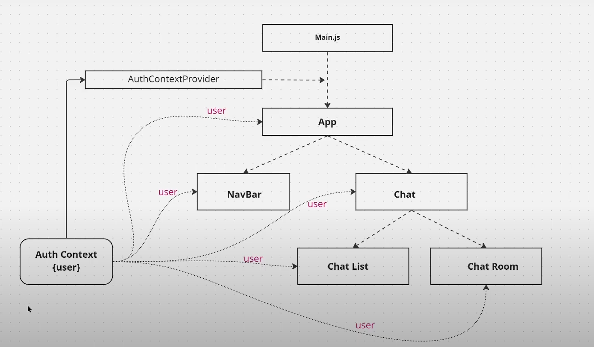

## Create Folder
- Client - fornt end folder
- Socket - socket .io server side code 
- Server - sever  side code

# Installation
1. cd Server 
2. npm init --yes  →  [**Create package.json**]  <`yes`: means defualt settings>
3. npm i express mongoose cors dotenv →  [**Install Express Framework**]  <`i`: install, '`mongoose`: Library DB, `cors`: help use to communicate with the fornt end, `dotenv`: lib work with env file> 
   <!-- Note: If you want to change default value form packege.json then -> npm i cors@2.8.5 dotenv@16.0.3 -->
4. npm i -g nodemon  →  [**Install Nodemon globally**]   <`nodemon` is a tool that will monitor your files {*any changes in file*} and restart the server automatically.
5. Create mongo DB  →  [ CLoud Mangodb ](https://www.mongodb.com/products/platform/cloud) - _Sign up_
   1. After created an account 
   2. Go to project and create a project -> fill the name: 'Chat-app' skip.. if u are the only one.
   3. if warning of IP address follow from last step
   4. Build Database - free *shared* {go with the default} - create cluster
   5. click Get connection string  {_Application Development_} 
      1. UserName & password {_to create database user_} => UN: ***** | PASS: *****
      2. Follow the steps {_Chose connection method_}
         1. Select your driver & Ver - set as default
         2. npm install mongodb - in  `Server` directory (root folder)
         3. Add your connection string *(mongodb+srv://ab00747...)* in [ Server -> `.env` ] file.
6. cd Server - to install other packages.
7. npm i bcrypt jsonwebtoken validator  →  `bcrypt` is used for hashing passwords, `jwt` for generating JSON Web Tokens that can be
   shorthand, `validator` to validate  data on client side.
8. cd Client (dir) 
9. npm create vite@latest   →  [__Install Vite__] (https://vitejs.dev/guide/)
   1.  Project name: >> .
   2.  Package: >>  **empty**. (_press enter_)
   3.  Select a framework: >> React
   4.  Select varient: >> JavaScript
   5.  npm install - downlaod all required  dependencies.
   6.  npm run dev - check from package.json file. Will Run dev script. Create Local
   7.  npm i react-router-dom - to Route
   8.  npm install react-bootstrap bootstrap - install bootstrap. (https://react-bootstrap.netlify.app/docs/getting-started/introduction)
   9.  Find good one and Downlaod it (**SVG**) - unDraw (Avater) - (https://undraw.co/)
   10. cd /Client -> npm i moment - Time using  library.

### Need to Know

node fileName.js  →   to excute the file in node
to see the output in real time use : http://localhost:5000/

`NOTE :`

-   - context API - able to share the data globally